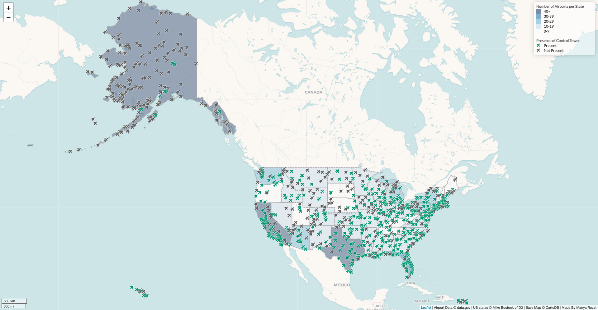

# Airports in the United States

The map created for this project illustrates details on all the airports in the United States. Data on the airports was gathered from data.gov, and the US state geometry was gathered from Mike Bostock of D3.

The information conveyed by this map are as follows: the physical location of the airports, the name of each airport, whether or not the airport has an air traffic control tower, and the total number of airports per state in relation to other states. Some of the types of airports on this map include international airports, regional airports, air force bases, and municipal or county airports.

The location of the airports are indicated by the placement of the plane icons on the map. The name of each airport appears as a pop-up when clicking on each plane icon. Whether or not the airport has an air traffic control tower is indicated by the color of the icon: green means that there is a control tower, and gray means that there is not. To convey the number of airports in each state, the map was designed as a choropleth map.

Some patterns I could discern from the map is that generally, larger states (by area and by population), have more airports. Airports with control towers tend to be situated either in or close to larger cities or towns. When it comes to the mainland US, it seems that there are more airports with a control tower. Alaska, however, while containing quite a large amount of airports, mostly has airports without a control tower.

